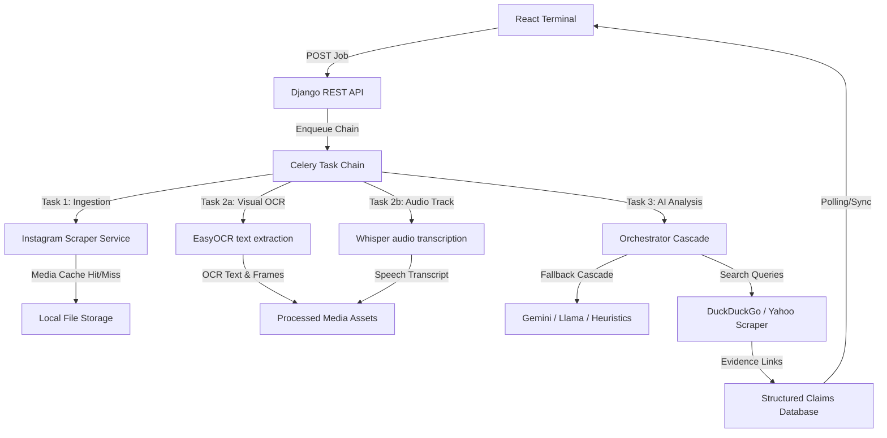
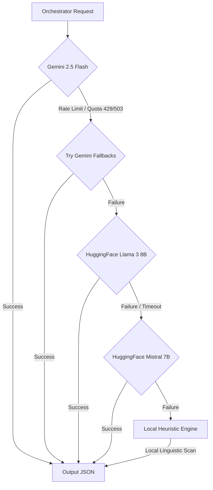
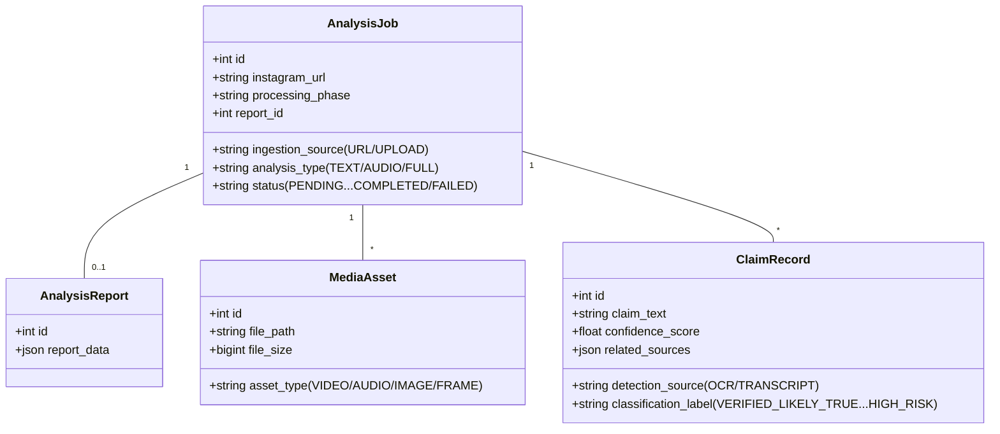

# PROJECT EDEN: TECHNICAL REPORT (QUICK GLANCE)
### Essential System Architecture & Codebase Overview
**Prepared for Academic Review & Rapid Study**

---

## 1. EXECUTIVE SUMMARY & LIFECYCLE

Project Eden is an asynchronous Open-Source Intelligence (OSINT) pipeline built on a decoupled **Django / Celery / Redis** backend and a **React** frontend dashboard. It automates the ingestion and fact-checking of multi-modal social media posts (videos, images, audio, and text). 

### 1.1 End-to-End Pipeline Execution
When a user submits a URL or uploads a video, the request is processed in the background through the following task sequence:

---

## 2. PIPELINE COMPONENTS & SERVICES

### 2.1 Ingestion Subsystem (`backend/ingestion`)
Eden uses a three-tier fallback mechanism to bypass login blocks and rate limits:
1.  **yt-dlp**: Primary video/audio downloader using session cookies loaded from `backend/config/cookies.txt`.
2.  **instaloader**: Used in `TEXT` mode to download static images if `yt-dlp` reports format errors.
3.  **Playwright**: Fallback headless browser that renders pages, evaluates media elements, and retrieves video/image sources directly.

### 2.2 Processing Layer (`backend/processing`)
-   **Audio Transcription**: FFmpeg extracts audio tracks, converting them to 16kHz mono WAV streams. These are transcribed using `openai-whisper` (running on CPU with `fp16=False` to prevent warnings).
-   **Visual OCR**: OpenCV extracts frames at 1 frame per second. Extracted frames are preprocessed using **CLAHE (Contrast Limited Adaptive Histogram Equalization)** to boost text readability. `easyocr` reads the text, filters low-confidence outputs (`<0.45`), and deduplicates adjacent frames.

---

## 3. AI ORCHESTRATOR & WEB VERIFICATION

### 3.1 LLM Fallback Cascade (`backend/analysis/services.py`)
To ensure high availability, the Orchestrator enforces Pydantic structured JSON schemas (`ReportModel`, `ClaimModel`) across a fallback chain:

1.  **Google Gemini**: Evaluates combined OCR and transcripts. If rate-limited, it automatically falls back to `gemini-2.5-flash-lite`, `gemini-1.5-flash`, and `gemini-1.5-pro` in sequence.
2.  **HuggingFace Inference API**: Triggered if Gemini fails. Queries `Llama-3-8B` or `Mistral-7B` and cleans the output markup to extract raw JSON.
3.  **Offline Heuristic Engine (`DegradedProvider`)**: Enaged if the server has no internet connection. Tokenizes inputs, scans for sensationalist keywords (e.g., *conspiracy*, *secret*, *unbelievable*), and computes a local risk score.

### 3.2 Live Verification Search (`backend/analysis/tasks.py`)
For each claim, the orchestrator generates a short keyword search query. Celery workers query **DuckDuckGo HTML search**. If blocked by a captcha, the system automatically falls back to **Yahoo Search**, parsing top results using `BeautifulSoup` to return provenance links.

---

## 4. DATABASE MODELS & SCHEMA

The database, defined in `backend/core_app/models.py`, tracks the execution state and fact-checking results:

---

## 5. ESSENTIAL CODEBASE MAP (QUICK GLANCE)

### 5.1 Backend Layout (`/backend`)
*   **`core/`**: Configures database settings, registers apps, and instantiates the Celery app (`celery.py`).
*   **`core_app/`**: Defines schemas for jobs, claims, report results, and media files (`models.py`).
*   **`api/`**: Declares viewsets and API routers (`views.py`, `urls.py`) to trigger jobs and query reports.
*   **`ingestion/`**: Manages media downloads (`yt-dlp`/`instaloader`/`playwright`) and hash caching (`cache.py`).
*   **`processing/`**: Runs video frame splitters (OpenCV), image preprocessing (CLAHE), easyocr OCR, and Whisper audio speech-to-text.
*   **`analysis/`**: Contains LLM connectors, fallback cascades, Pydantic schemas, and web search verification crawlers.

### 5.2 Frontend Layout (`/frontend/src`)
*   **`App.jsx`**: Manages routing between the submission page (`/`) and bento dashboard (`/operation/:id`).
*   **`tokens.css`**: Design tokens. Defines dark slate base backgrounds and glowing neon border colors mapping to claim statuses.
*   **`components/CommandBar.jsx`**: Submit terminal supporting url parsing and video drag-and-drop.
*   **`components/JobStatus.jsx`**: State indicator displaying Celery status updates.
*   **`components/ReportDashboard.jsx`**: Grid layout rendering claims, overall risk dials, timelines, and text overlays.
*   **`components/CredibilityTimeline.jsx`**: Interactive component aligning video progress bar to timestamps of transcribed speech and OCR text.
*   **`components/DetailDrawer.jsx`**: Slide-out drawer with confidence graphs, LLM verdicts, and external search evidence.
