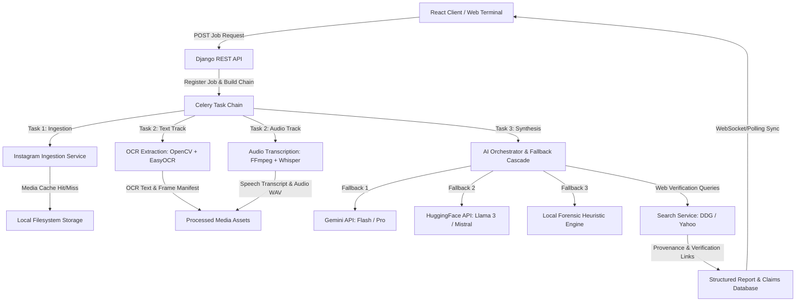
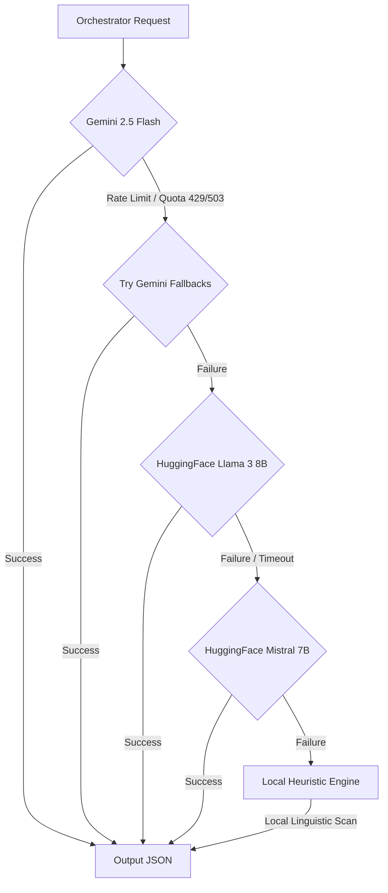

# Project Eden: Multimodal Misinformation OSINT Engine
## Technical System Report & Architecture Spec

Project Eden is a high-fidelity, asynchronous Open-Source Intelligence (OSINT) pipeline designed to extract, analyze, and classify misinformation within social media assets. Built on a robust Django/Celery/Redis backend and a React-based "Cold Signal" intelligence terminal frontend, Eden processes both public Instagram URLs and local video uploads. It extracts visual and spoken text tracks, performs orchestrated multi-provider AI reasoning, maps assertions to factual sources via real-time web searches, and visualizes the results on a bento-style dashboard.

---

## 1. System Architecture & Lifecycle

Eden operates as a decoupled, multi-modal pipeline orchestrated by Celery task chains. Below is the technical flow of an analysis job from submission to completion:



---

## 2. Ingestion & Caching Layer

The ingestion subsystem manages the acquisition of media files from the web while enforcing strict constraints depending on the processing mode.

### Media Acquisition Services
The ingestion routine is implemented in [services.py](file:///c:/Holidays/Eden/backend/ingestion/services.py) and called asynchronously via [tasks.py](file:///c:/Holidays/Eden/backend/ingestion/tasks.py). It features:
*   **Mode-Aware Downloads**:
    *   **`TEXT` Mode**: Acquires reels, videos, or image posts. It prioritizes `yt-dlp` to download video streams. If `yt-dlp` reports a format error (indicating a static image post), the ingestion engine falls back to `instaloader` to download the image.
    *   **`AUDIO` Mode**: Specifically fetches audio/video streams using the `bestvideo+bestaudio/best` format filter to ensure the client has both a media preview and an audio track. If the URL resolves to a static image post containing no audio format, the ingestion task triggers a `MODE_MISMATCH` exception.
*   **Session-Based Authentication**: Instagram restricts unauthenticated access. Eden loads Netscape-formatted cookies from [cookies.txt](file:///c:/Holidays/Eden/backend/config/cookies.txt) to authenticate both `yt-dlp` and `instaloader` sessions, preventing rate limits and login walls.
*   **Error Classification & Fast Termination**:
    *   `RATE_LIMIT_OR_LOGIN`: Raised when Instagram blocks access.
    *   `PRIVATE_CONTENT`: Raised when accessing private posts.
    *   `CONTENT_NOT_FOUND`: Raised for deleted or invalid URLs.
    *   `MODE_MISMATCH`: Raised when static image posts are submitted in `AUDIO` mode. This halts the Celery task chain immediately by wiping `self.request.chain` to prevent downstream execution.

### Filesystem Caching Strategy
To avoid redundant processing and API calls, the [cache.py](file:///c:/Holidays/Eden/backend/ingestion/cache.py) cache system tracks previous runs using a hash of the target URL or the Instagram shortcode as the key.

> [!NOTE]
> By default, the media cache uses a Time-To-Live (TTL) configuration. In development environments, setting `MEDIA_CACHE_TTL_DAYS = 0` configures entries to never expire.

#### Directory Layout
```
media/cache/{cache_key}/
├── source_media.mp4     <- Local copy of the downloaded media
├── audio.wav            <- Converted 16kHz mono audio track
├── transcript.json      <- Deduplicated Whisper transcription JSON
├── ocr.json             <- EasyOCR results and frame manifest JSON
└── frames/              <- Directory of JPEGs extracted for OCR
    ├── frame_0000.jpg
    └── thumb_0000.jpg
```

---

## 3. Multimodal Processing Pipeline

Once the raw media is downloaded, Eden routes it to the OCR or transcription task based on the job mode.

### OCR & Video Frame Processing
The OCR service, detailed in [services.py](file:///c:/Holidays/Eden/backend/processing/services.py), processes visual content through a two-step framework:

1.  **OpenCV Frame Extraction**:
    *   Extracts exactly 1 frame per second of video.
    *   Writes full-resolution JPEGs (quality 90) and downscaled 320px thumbnails (quality 80).
    *   Compiles a manifest file `frame_manifest.json` referencing timestamps, frame paths, and thumbnails.
2.  **EasyOCR Text Extraction**:
    *   Applies a preprocessing pipeline: converts frames to grayscale, followed by Contrast Limited Adaptive Histogram Equalization (CLAHE) with `clipLimit=2.0` and `tileGridSize=(8,8)` to enhance text readability.
    *   Uses the `easyocr.Reader` to extract text blocks.
    *   Filters out low-confidence outputs (probability `< 0.45`) or junk text (alphanumeric character ratio `< 40%`).
    *   Deduplicates adjacent frames: only records new text blocks that were not present in the preceding frame.
    *   Constructs a unified, timestamped transcript (e.g., `[00:04] LATEST UPDATE`).

### Audio Extraction & Transcription
Audio processing, located in [services.py](file:///c:/Holidays/Eden/backend/processing/services.py), handles audio transcription:

1.  **FFmpeg Stream Isolation**:
    *   Probes the file using `ffprobe` to check for an audio stream. Silent videos return `None` and skip transcription.
    *   Extracts the audio track and converts it into a 16kHz, single-channel (mono) PCM WAV file optimized for model input.
2.  **Whisper Model Transcription**:
    *   Loads the `base` model from `openai-whisper`.
    *   Configures CPU-friendly compatibility by setting `fp16=False` to prevent floating-point warnings.
    *   Deduplicates adjacent segments to eliminate Whisper transcription loops and hallucinations.
    *   Extracts a video thumbnail at the 1-second mark via FFmpeg to serve as the report preview.

---

## 4. AI Orchestrator & Fallback Cascades

The AI analysis logic, defined in [services.py](file:///c:/Holidays/Eden/backend/analysis/services.py), orchestrates structured JSON generation and implements a robust provider fallback sequence.



### 1. Primary Layer: Google Gemini
Uses `google-genai` to run `gemini-2.5-flash`. The model is configured with strict structural specifications using Pydantic:
*   **Response Schema**: Enforces structured JSON compliance via `response_schema=ReportModel` and `response_mime_type="application/json"`.
*   **Gemini Retry Cascade**: If the primary endpoint fails due to quota limits or service interruptions, the provider retries the request across alternate Gemini models in sequence:
    1.  `gemini-2.5-flash-lite`
    2.  `gemini-1.5-flash`
    3.  `gemini-1.5-pro`

### 2. Secondary Layer: HuggingFace API (Llama & Mistral)
If all Gemini attempts fail, the orchestrator routes the request to HuggingFace hosted Inference API endpoints:
*   **Llama 3**: Evaluates prompt instructions using `meta-llama/Meta-Llama-3-8B-Instruct`.
*   **Mistral 7B**: Serves as a backup via `mistralai/Mistral-7B-Instruct-v0.3`.
*   **Parsing Strategy**: Since HuggingFace endpoints do not guarantee structured JSON formatting, the client formats instructions manually, strips markdown code blocks (e.g., ` ```json `), and validates the parsed dictionary.

### 3. Tertiary Layer: Local Offline Forensic Heuristic Engine
If the network is unavailable or cloud APIs fail, the orchestrator falls back to the native `DegradedProvider`:
*   Tokenizes and parses combined visual OCR and speech text logs locally using regex.
*   Calculates a local risk index by checking for sensationalist, clickbait, or speculative terminology (e.g., *conspiracy*, *nightmare*, *secret*, *miracle*, *hidden*).
*   Compiles a mock `ReportModel` containing extracted sentences as claims, mapping the source text to OCR and transcript logs.

---

## 5. Web Verification & Provenance Linkage

To verify claims, the orchestrator generates an optimized search query for each extracted claim. The [tasks.py](file:///c:/Holidays/Eden/backend/analysis/tasks.py) file runs a real-time web search to find references:

1.  **DuckDuckGo HTML Parser**:
    *   Queries `https://html.duckduckgo.com/html/?q={query}`.
    *   Parses search results with `BeautifulSoup`.
    *   Resolves and decodes DDG redirect parameters (`uddg`).
    *   Extracts titles, URLs, and text snippets for the top 3-4 results.
2.  **Yahoo Search Fallback**:
    *   If DuckDuckGo blocks the request with a captcha, the system falls back to `https://search.yahoo.com/search?p={query}`.
    *   Extracts URLs, cleans up Yahoo redirect structures (`RU=`), and appends results with a static provenance note.

This link-checking pipeline binds verified external sources directly to each claim, enabling users to audit statements against the web.

---

## 6. Core Database Schema & Data Models

Eden's database models, defined in [models.py](file:///c:/Holidays/Eden/backend/core_app/models.py), track processing metadata, claims, and analysis logs.

```
                  +-----------------------------------+
                  |            AnalysisJob            |
                  |-----------------------------------|
                  | id (PK)                           |
                  | instagram_url (null/blank)        |
                  | ingestion_source (URL/UPLOAD)     |
                  | analysis_type (TEXT/AUDIO/FULL)   |
                  | status (Enum State Machine)       |
                  | processing_phase (Text updates)   |
                  | error_message (Text)              |
                  +-----------------+-----------------+
                                    | 1
                                    |
                                    | 1
                  +-----------------v-----------------+
                  |          AnalysisReport           |
                  |-----------------------------------|
                  | id (PK)                           |
                  | report_data (JSON Field)          |
                  +-----------------------------------+
                                    | 1
                                    |
                                    | *
                  +-----------------v-----------------+
                  |            MediaAsset             |
                  |-----------------------------------|
                  | id (PK)                           |
                  | asset_type (Enum)                 |
                  | file_path (Text)                  |
                  | file_size (BigInt)                |
                  | metadata (JSON Field)             |
                  +-----------------------------------+
                                    | 1
                                    |
                                    | *
                  +-----------------v-----------------+
                  |            ClaimRecord            |
                  |-----------------------------------|
