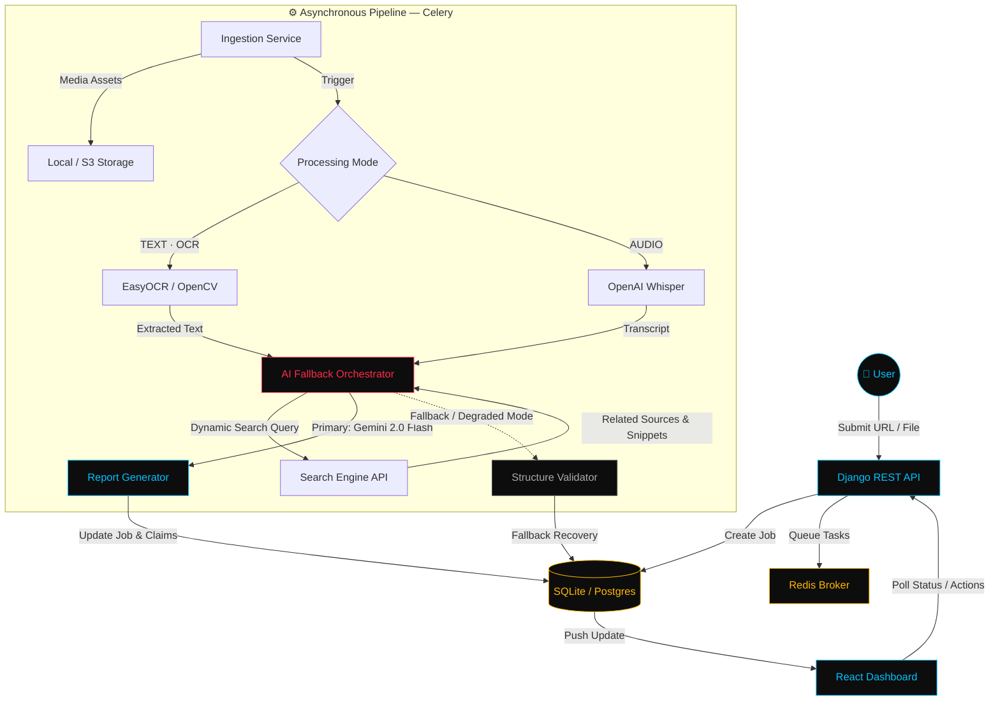
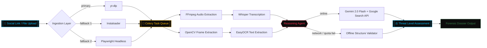

<div align="center">

```text
┌──────────────────────────────────────────────────────────────────────┐
│                                                                      │
│   ███████╗██████╗ ███████╗███╗   ██╗                                 │
│   ██╔════╝██╔══██╗██╔════╝████╗  ██║                                 │
│   █████╗  ██║  ██║█████╗  ██╔██╗ ██║                                 │
│   ██╔══╝  ██║  ██║██╔══╝  ██║╚██╗██║                                 │
│   ███████╗██████╔╝███████╗██║ ╚████║                                 │
│   ╚══════╝╚═════╝ ╚══════╝╚═╝  ╚═══╝                                 │
│                                                                      │
│           F O R E N S I C   O S I N T   I N T E L L I G E N C E      │
│                                                                      │
└──────────────────────────────────────────────────────────────────────┘
```

### Cold Intelligence for a Hot Information War.
**A forensic media fact-checking terminal — built to ingest, dissect, and verify claims at machine speed.**

<br/>

[](https://github.com/Arnim-Zola/Eden/stargazers)
[](https://github.com/Arnim-Zola/Eden/network/members)
[](https://github.com/Arnim-Zola/Eden/issues)
[](https://github.com/Arnim-Zola/Eden/commits)
[](#contributing)

<br/>

<a href="#overview">Overview</a> ·
<a href="#pipeline-architecture">Architecture</a> ·
<a href="#core-features">Features</a> ·
<a href="#tech-stack">Stack</a> ·
<a href="#getting-started">Quickstart</a> ·
<a href="#contributors">Team</a>

</div>

<br/>

<p align="center">
  
  
  
  
  
  
</p>

---

<br/>

**`SECTION 01`**
## Overview

Eden is a production-grade cyber-intelligence and OSINT platform built to ingest, process, and analyze social media streams — unmasking misinformation by extracting factual claims and cross-referencing them against live, authoritative web sources in real time. Every submission — a link or a raw file — is torn down into its component signals: visual text, spoken audio, and contextual metadata, then reassembled into a forensic verdict a human analyst can trust.

<div align="center">

```text
┌─ EDEN // FORENSIC WORKSPACE ──────────────────────────── [SYS] [X] ─┐
│                                                                     │
│  === SYS_MONITOR ===            ┌── COMMAND_BAR ───────────────┐    │
│  CPU  [|||||     ]  42%         │ > analyze --url=ig.reel/8x2k │    │
│  MEM  [|||||||   ]  61%         └──────────────────────────────┘    │
│  CELERY_WORKER ................. ONLINE                             │
│                                                                     │
│  ┌── FORENSIC TRANSCRIPT ────────┐ ┌── RELATIONSHIP GRAPH ─────┐    │
│  │ 00:04  "...the vaccine        │ │        * claim_014        │    │
│  │         causes..."            │ │       /     \             │    │
│  │ ~~~~~~~~~~~~~~~~~~~~~~~~~~~   │ │   * src_A   * src_B       │    │
│  └───────────────────────────────┘ └───────────────────────────┘    │
│                                                                     │
│  VERDICT ───────────────────────────────────────────────────────    │
│  ● RED — FLAGGED   |  confidence 0.91  |  3 sources cross-ref'd     │
└─────────────────────────────────────────────────────────────────────┘
```

*Illustrative terminal output — add a real capture here once your pipeline is live.*

</div>

<br/>

**`SECTION 02`**
## Pipeline Architecture

Eden decomposes incoming media (Instagram Reels, uploads, images) into independent processing lanes, extracting and validating intelligence asynchronously through a Celery-orchestrated pipeline.



> **How Eden thinks:** Gemini 2.0 Flash is the primary reasoning engine, grounded against live Google Search results for every claim. If the network or the quota drops out mid-investigation, the Offline Structure Validator takes over — degrading gracefully to a rule-based verdict rather than failing the job outright.

<br/>

**`SECTION 03`**
## Core Features

<table>
  <tr>
    <td width="50%" valign="top">
      <h3>🔍 Deep Web Cross-Referencing</h3>
      <p>Queries live authoritative fact databases and high-credibility journals, pulling domain verifications, matching claims, and sourcing up to 4 distinct references with exact text matches.</p>
    </td>
    <td width="50%" valign="top">
      <h3>📈 Dynamic Audio Spectrogram</h3>
      <p>An interactive, canvas-based frequency spectrum analyzer with real-time magnetic cursor-pull hover states and responsive neon soundwave playback visualizations.</p>
    </td>
  </tr>
  <tr>
    <td width="50%" valign="top">
      <h3>🕸️ Interactive Relationship Graph</h3>
      <p>Visualizes connections between a media asset, its active pipelines (OCR, Whisper), and the resulting claims in a spring-physics SVG network graph with dynamic edge-pulse vectors.</p>
    </td>
    <td width="50%" valign="top">
      <h3>📟 Tactical System Telemetry HUD</h3>
      <p>A floating, collapsible console displaying real-time background logs, CPU/memory performance, Celery daemon health, and an active oscilloscope monitor.</p>
    </td>
  </tr>
  <tr>
    <td width="50%" valign="top">
      <h3>🛰️ Multi-Path Ingestion</h3>
      <p>Cascades through <code>yt-dlp</code> → <code>Instaloader</code> → Playwright headless capture, so a single blocked or rate-limited path never stalls the pipeline.</p>
    </td>
    <td width="50%" valign="top">
      <h3>⚖️ Threat Level Verdicts</h3>
      <p>Every dossier resolves to a color-coded verdict — flagged, disputed, or corroborated — with a numeric confidence score and full source attribution.</p>
    </td>
  </tr>
</table>

<br/>

**`SECTION 04`**
## System Architecture



<br/>

**`SECTION 05`**
## Tech Stack

<table>
<tr><th align="left">Layer</th><th align="left">Technologies</th></tr>
<tr>
<td><strong>Frontend</strong></td>
<td>

`React 18` · `Vite` · `Framer Motion` · `Tailwind CSS` · `Lucide Icons` · `HTML5 Canvas`

</td>
</tr>
<tr>
<td><strong>Backend</strong></td>
<td>

`Python 3.11+` · `Django REST Framework` · `SQLite` (dev) · `PostgreSQL` (prod)

</td>
</tr>
<tr>
<td><strong>Async Pipeline</strong></td>
<td>

`Celery` · `Redis` (broker)

</td>
</tr>
<tr>
<td><strong>AI / Processing Core</strong></td>
<td>

`OpenAI Whisper` (transcription) · `OpenCV` + `EasyOCR` (vision/OCR) · `Google Gemini 2.0 Flash` (reasoning) · `Google Search API` (cross-referencing)

</td>
</tr>
<tr>
<td><strong>Ingestion Tooling</strong></td>
<td>

`yt-dlp` · `Instaloader` · `Playwright` · `FFmpeg`

</td>
</tr>
</table>

<br/>

**`SECTION 06`**
## Getting Started

### Prerequisites

| Requirement | Notes |
|---|---|
| Python 3.11+ | Backend runtime |
| Node.js | Frontend tooling (Vite) |
| Redis | Local or remote — required as the Celery broker |
| FFmpeg | Must be available on `PATH` for audio extraction |

<details open>
<summary><strong>🐍 Backend Deployment</strong></summary>

<br/>

```bash
cd backend
python -m venv venv
source venv/Scripts/activate   # macOS/Linux: source venv/bin/activate
pip install -r requirements.txt
python manage.py migrate
python manage.py runserver
```

> **Note:** Launch the Celery worker daemon in a separate terminal:
> ```bash
> python -m celery -A core worker --loglevel=info --pool=solo
> ```

</details>

<details open>
<summary><strong>⚛️ Frontend Deployment</strong></summary>

<br/>

```bash
cd frontend
npm install
npm run dev
```

</details>

<br/>

**`SECTION 07`**
## Project Structure

```text
Eden/
├── backend/
│   ├── analysis/       # AI reasoning providers (Gemini, fallback agents)
│   ├── api/             # REST Framework views & routing
│   ├── core/             # Settings & Celery scheduler configuration
│   ├── core_app/          # Database schemas & models (Job, Report, MediaAsset)
│   ├── ingestion/          # Media download engine (yt-dlp, Playwright)
│   ├── processing/          # Computer vision (OCR) & audio transcription (Whisper)
│   └── media/                 # Local disk cache for processed assets
└── frontend/
    └── src/
        ├── components/    # Core tactical UI dashboard panels & overlays
        ├── hooks/          # LocalStorage persistence & window handlers
        ├── services/        # REST endpoint abstraction layer
        └── views/             # Global page-level containers
```

<br/>

**`SECTION 08`**
## Roadmap

> A starting checklist — edit freely to reflect the team's actual priorities.

- [ ] Multi-language OCR & transcription support
- [ ] Browser extension for one-click submission from any feed
- [ ] Batch analysis mode for bulk media sets
- [ ] Exportable, shareable PDF forensic dossiers
- [ ] Public API for third-party integrations

<br/>

**`SECTION 09`**
## Contributing

Contributions are welcome. The usual flow:

1. Fork the repository
2. Create a feature branch — `git checkout -b feature/your-feature`
3. Commit your changes — `git commit -m 'Add your feature'`
4. Push to the branch — `git push origin feature/your-feature`
5. Open a Pull Request

<br/>

**`SECTION 10`**
## Contributors

<a href="https://github.com/Arnim-Zola/Eden/graphs/contributors">
  
</a>

| Contributor | Focus |
|---|---|
| **Mohammed Sahil** ([@Arnim-Zola](https://github.com/Arnim-Zola)) | Core Architect, Ingestion Pipeline & React Engine |
| **Madhava K S** ([@Madhavaks7](https://github.com/Madhavaks7)) | Backend Integration, Celery Choreography & DevOps |
| **Sufiyaan** ([@suffi084](https://github.com/suffi084)) | Extraction Services, EasyOCR Models & Forensic UI |
| **Mithun** ([@mithungit56](https://github.com/mithungit56)) | UI/UX Overhauls, Animation Systems & PDF Dossier |

<br/>

**`SECTION 11`**
## License

No license file is currently present in this repository. Add a `LICENSE` file (MIT, Apache-2.0, etc.) if you intend for others to use, modify, or distribute this project — until then, all rights are reserved by default.

<br/>

---

<div align="center">

### Star History

<a href="https://star-history.com/#Arnim-Zola/Eden&Date">
  
</a>

<br/><br/>

**Designed & engineered for high-fidelity misinformation investigation 🌿**

</div>