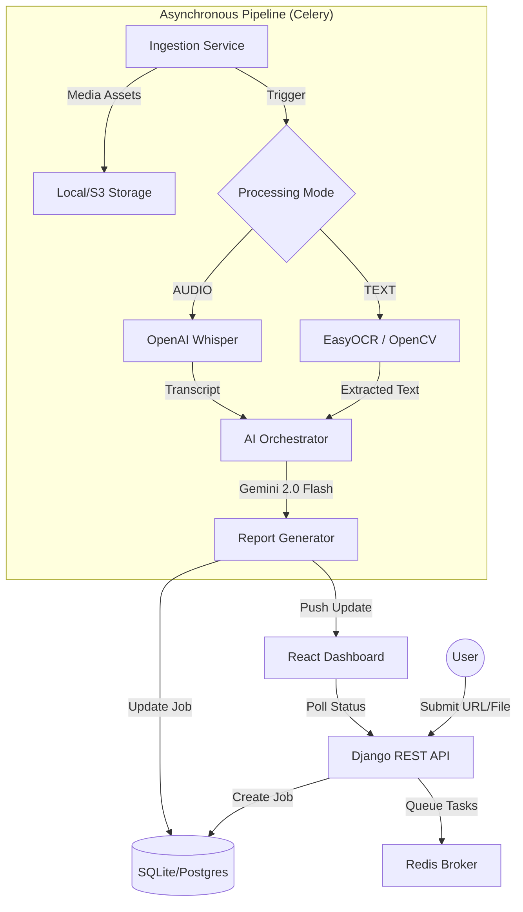

# 🌿 Eden: AI-Powered Misinformation Analysis Engine

[](https://www.djangoproject.com/)
[](https://reactjs.org/)
[](https://docs.celeryq.dev/)
[](https://redis.io/)
[](https://deepmind.google/technologies/gemini/)
[](https://tailwindcss.com/)

> **Unmasking misinformation through multi-modal AI orchestration.** Eden is a production-grade platform designed to ingest, process, and analyze social media content to detect and verify factual claims with surgical precision.

---

## 📖 Project Overview

In an era of rapid digital information flow, the speed of misinformation often outpaces human fact-checking capabilities. **Eden** addresses this challenge by providing an automated, multi-modal pipeline that extracts semantic intelligence from both visual and auditory streams.

Whether it's an Instagram Reel, a static image post, or a local video upload, Eden decomposes the media into its fundamental parts—frames, audio tracks, and text—and applies state-of-the-art AI reasoning to identify, classify, and verify claims.

### Why Eden Matters
- **Automated Verification**: Reduces the manual effort required to fact-check short-form video content.
- **Evidence-First Design**: Every AI-generated claim is backed by direct references to OCR snippets or audio timestamps.
- **Scalable Architecture**: Built on a decoupled asynchronous task system capable of handling high-volume ingestion and heavy AI workloads.

---

## ✨ Core Features

### 📡 Intelligent Ingestion
- **Social Media Integration**: Native support for Instagram URLs (Reels, Posts, Carousels) using a robust session-aware ingestion layer.
- **Direct Uploads**: Support for major video formats (MP4, MOV, AVI) for local file analysis.
- **Resilient Downloader**: Hybrid ingestion using `yt-dlp` and `instaloader` with automated session persistence and rate-limit handling.

### 🧠 Multi-Modal Processing
- **Computer Vision (OCR)**: Frame-by-frame text extraction using **EasyOCR** and **OpenCV** with intelligent deduplication.
- **Audio Intelligence**: High-fidelity transcription using **OpenAI Whisper**, converting speech into structured, timestamped text.
- **Frame Extraction**: Automated extraction of keyframes (1 FPS) for visual context analysis.

### 🤖 AI Orchestration & Reasoning
- **Semantic Analysis**: Powered by **Google Gemini 2.0 Flash** to extract factual assertions and provide contextual reasoning.
- **Fault-Tolerant Failover**: Automated fallback to "Degraded Mode" for gracefully handling API quotas or transient failures without losing data.
- **Structured Output**: Pydantic-validated JSON reports ensuring strict schema adherence for downstream applications.

### 📊 Professional Dashboard
- **Bento-Style Report**: A modern, high-density visualization of analysis results, risk scores, and claim timelines.
- **⌘K Command Palette**: A keyboard-first interface for lightning-fast navigation and history management.
- **Pipeline Visualization**: Real-time tracking of the multi-stage processing pipeline from ingestion to final report.

---

## 🏗️ System Architecture

Eden follows a modular, service-oriented architecture designed for high availability and observability.



### Key Architectural Decisions
1. **Asynchronous Chaining**: Tasks are organized into linear Celery chains (Ingest → Process → Analyze), ensuring data integrity and allowing for granular retry logic.
2. **Media Caching Layer**: Filesystem-based caching with TTL-aware management prevents redundant downloads and reduces external API costs.
3. **Provider Abstraction**: The AI analysis layer is abstracted via a provider interface, allowing for seamless switching between Gemini, GPT-4, or local LLMs.

---

## 🛠️ Tech Stack

| Layer | Technology |
| :--- | :--- |
| **Frontend** | React 18, Vite, Tailwind CSS, Framer Motion, Lucide Icons |
| **Backend** | Python 3.11+, Django, Django REST Framework |
| **Task Queue** | Celery, Redis |
| **Database** | SQLite (Dev) / PostgreSQL (Prod) |
| **AI / ML** | Google Gemini (LLM), OpenAI Whisper (ASR), EasyOCR (OCR) |
| **Processing** | FFmpeg, OpenCV, yt-dlp, Instaloader |
| **DevOps** | Docker, Docker Compose |

---

## 🚀 Getting Started

### Prerequisites
- Python 3.11+
- Node.js 18+
- Redis Server
- FFmpeg (for audio/video processing)
- **Google Gemini API Key**

### Environment Setup
Create a `.env` file in the root directory:
```env
# Backend
SECRET_KEY=your-django-secret
DEBUG=True
GEMINI_API_KEY=your-gemini-key
REDIS_URL=redis://localhost:6379/0

# Frontend
VITE_API_URL=http://localhost:8000/api
```

### Backend Installation
```bash
cd backend
python -m venv venv
source venv/scripts/activate  # Windows: venv\Scripts\activate
pip install -r requirements.txt
python manage.py migrate
python manage.py runserver
```
*Note: Ensure `celery -A core worker --loglevel=info` is running.*

### Frontend Installation
```bash
cd frontend
npm install
npm run dev
```

---

## 📂 Project Structure

```text
Eden/
├── backend/
│   ├── analysis/     # AI Provider Orchestration (Gemini, Fallbacks)
│   ├── api/          # REST Endpoints & Serializers
│   ├── core/         # Project settings & Celery config
│   ├── core_app/     # Database Models (Job, Report, MediaAsset)
│   ├── ingestion/    # Media Scrapers (yt-dlp, instaloader)
│   ├── processing/   # Computer Vision (OCR) & Audio (Whisper)
│   └── media/        # Local storage for processed artifacts
├── frontend/
│   ├── src/
│   │   ├── components/ # Atomic UI & Feature-specific components
│   │   ├── hooks/      # Custom React hooks (History, Polling)
│   │   ├── services/   # API abstraction layer
│   │   └── views/      # Page-level containers
└── docker-compose.yml
```

---

## 📈 Performance & Scalability
- **Concurrency**: Celery workers handle heavy ML tasks (Whisper/OCR) off the main thread, keeping the API responsive.
- **Efficient IO**: FFmpeg stream-probed ingestion ensures we only download necessary media streams.
- **Smart Caching**: Ingestion and AI results are cached based on content hash/URL to minimize latency for repeat analyses.

---

## 🔮 Future Improvements
- [ ] **Vector Search**: Implementation of a RAG (Retrieval-Augmented Generation) layer for comparing claims against trusted fact-check databases.
- [ ] **Multi-Post Analysis**: Batch processing for entire Instagram profiles or hashtag feeds.
- [ ] **Browser Extension**: Real-time claim verification directly in the Instagram web interface.

---

## 📄 License
This project is licensed under the MIT License - see the [LICENSE](LICENSE) file for details.

---

<p align="center">
  Built with 🌿 by the Eden Team
</p>